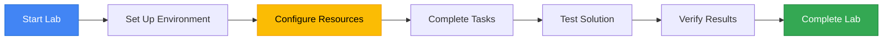

<div align="center">

# Implementing Security in Dataplex
### Google Cloud Skills Boost - Lab GSP1157

[]( https://www.skills.google/catalog_lab/6566 )

##  Lab Overview

This lab provides hands-on experience with Google Cloud services. You'll learn key concepts, configure resources, and gain practical skills for working with cloud infrastructure and applications.



---
##  Quick Start Guide

Copy and paste the following commands into your Cloud Shell terminal:

```bash
curl -LO raw.githubusercontent.com/eccentriccoder01/Google-Arcade-Labs-EduLinkUp/refs/heads/main/Implementing%20Security%20in%20Dataplex/EduLinkUp.sh
sudo chmod +x EduLinkUp.sh 
./EduLinkUp.sh
```


> **Note:** The script automates repetitive setup tasks. We encourage you to review the script content to understand each step and learn the underlying Google Cloud operations.

---

<div align="center">

## **Google Cloud Arcade Hub**

</div>

<p>
Discover the Google Cloud Arcade Hub - <b>Track progress with EduLinkUp's exclusive Arcade points calculator</b>, Skill Badges, Arcade Games and Arcade Trivia, explore lab-free courses, and join the Facilitator program for milestones, recognition, and swags.
</p>

<div align="center">

[](https://edulinkup.dev/arcade-calculator)

</div>

<ul>
<li><strong>Arcade Points Calculator</strong>: Estimate points, plan goals, and see leaderboard impact.</li>
<li><strong>Badges & Games</strong>: Earn badges for achievements and play bite-sized learning games.</li>
<li><strong>Lab-Free Courses</strong>: Access curated, free learning paths and practice labs to achieve milestones in the Facilitaor Program.</li>
<li><strong>Facilitator Program</strong>: Guides, milestone tracking, community roles, and swags.</li>
</ul>

## 🔐 Important Notice

```mermaid
graph LR
    Start([Use This Resource?]) --> Question{What's Your Goal?}
    Question -->|Learn & Understand| Manual[📚 Study the Code]
    Question -->|Quick Review| Auto[âš¡ Use Automation]
    Question -->|Certification Prep| Both[🎯 Do Both]
    
    Manual --> Read[Read Script Line by Line]
    Read --> Understand[Understand Each Command]
    Understand --> Practice[Practice Manually First]
    
    Auto --> Review[Review Before Running]
    Review --> Execute[Execute Script]
    Execute --> Reflect[Reflect on Output]
    
    Both --> Manual
    Both --> Auto
    
    Practice --> Success([✅ Deep Learning Achieved])
    Reflect --> Success
    
    style Start fill:#E3F2FD,stroke:#1976D2,color:#000
    style Success fill:#C8E6C9,stroke:#388E3C,color:#000
    style Manual fill:#FFF3E0,stroke:#F57C00,color:#000
    style Auto fill:#F3E5F5,stroke:#7B1FA2,color:#000
    style Both fill:#E0F2F1,stroke:#00796B,color:#000
```

<div align="center">



</div>

<details>
<summary><b> ⚠️ Disclaimer ⚠️- 📖 Educational Use Policy (Expand)</b></summary>

<br>

**Purpose**  
This repository provides learning resources to help you understand Google Cloud Platform services. The automation scripts are designed to demonstrate best practices and accelerate your learning journey.

<table>
<tr>
<td width="50%" valign="top">

### Google Cloud Skills Boost - Lab GSP1157

- Study and understand the underlying Google Cloud operations
- Learn automation techniques for cloud infrastructure
- Prepare for certification or professional development
- Review concepts after manual completion

</td>
<td width="50%" valign="top">

### Google Cloud Skills Boost - Lab GSP1157

- Comply with Google Cloud Skills Boost terms of service
- Use scripts for educational purposes only
- Complete manual labs first before using automation
- Give proper attribution if sharing or modifying

</td>
</tr>
</table>

**Ethical Considerations**  
We believe in learning through understanding. While our scripts save time, we strongly encourage you to:

<div align="center">

| Step | Action | Why It Matters |
|------|--------|----------------|
| 1️⃣ | Read through the script code | Understand what will happen |
| 2️⃣ | Complete labs manually first | Build foundational knowledge |
| 3️⃣ | Understand each command | Learn the "why" not just "how" |
| 4️⃣ | Use automation as a tool | Reinforce learning, don't replace it |

</div>

</details>

---

## 🛠️ Troubleshooting

```mermaid
graph LR
    Issue[❌ Encountered Issue?] --> Type{Issue Type}
    
    Type -->|Permission| P1[Check IAM Roles]
    Type -->|API| A1[Verify API Enabled]
    Type -->|Authentication| Auth1[Re-authenticate]
    Type -->|Script| S1[Check Script Syntax]
    
    P1 --> P2[Add Required Permissions]
    A1 --> A2[Enable in Console]
    Auth1 --> Auth2[gcloud auth login]
    S1 --> S2[Review Error Output]
    
    P2 --> Retry[🔄 Retry Operation]
    A2 --> Retry
    Auth2 --> Retry
    S2 --> Retry
    
    Retry --> Success{Fixed?}
    Success -->|Yes| Done([✅ Resolved])
    Success -->|No| Help[📞 Seek Help]
    
    style Issue fill:#FFCDD2,stroke:#C62828,color:#000
    style Done fill:#C8E6C9,stroke:#388E3C,color:#000
    style Retry fill:#FFF9C4,stroke:#F9A825,color:#000
    style Help fill:#E1BEE7,stroke:#8E24AA,color:#000
```

<div align="center">



</div>

<br>

Having issues? Here are quick solutions:

| Issue | Solution |
|-------|----------|
| Script won't run | Check execute permissions with `ls -la` |
| Authentication errors | Verify you're logged into the correct project |
| API not enabled | Enable required APIs in console |
| Timeout errors | Check your internet connection and retry |
| Permission denied | Ensure your account has proper IAM roles |

---

## **Join Our Growing Ecosystem**

[](https://edulinkup.dev) [](https://www.linkedin.com/company/edulinkup) [](https://www.youtube.com/@EduLinkUp)

---

### Google Cloud Skills Boost - Lab GSP1157

<div align="center">
<a href="https://www.linkedin.com/in/eccentricexplorer" target="_blank" rel="noopener noreferrer">
    
</a> &nbsp;
<a href="https://www.linkedin.com/in/akshaykumar0611" target="_blank" rel="noopener noreferrer">
    
</a>

<br/>

<p>
  <a href="https://www.linkedin.com/in/eccentricexplorer">
    
  </a> &nbsp;
  <a href="https://www.linkedin.com/in/akshaykumar0611">
    
  </a>
</p>

</div>

---

### Google Cloud Skills Boost - Lab GSP1157

**Stay updated with everything happening in the EduLinkUp universe:**

[](https://chat.whatsapp.com/HN5eOl0p5DBKBqTbIiOTgv)

</div>

---

<div align="center">

*This guide was crafted with care to enhance your Google Cloud learning experience.*  
*Remember: Understanding beats completion. Take your time and enjoy the journey.*

<sub>Last updated: January 2026 | Version 1.0</sub>

</div>


