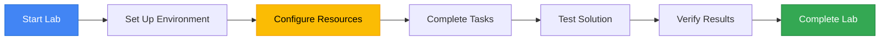

<div align="center">

# Kickstarting Application Development with Gemini Code Assist: Challenge Lab
### Google Cloud Skills Boost - Lab GSP527

[]( https://www.skills.google/catalog_lab/32458 )

##  Lab Overview

This lab provides hands-on experience with Google Cloud services. You'll learn key concepts, configure resources, and gain practical skills for working with cloud infrastructure and applications.



---
##  Quick Start Guide

## Task-2 `backend/index.test.ts`:

```bash
// Gemini: Write a test for the /outofstock endpoint to verify it returns a status 200 and a list of 2 items.
```
```bash
cd cymbal-superstore/backend
npm install
npm run test
```
## Task-3 `backend/index.ts`:
```bash
// This endpoint should return all out-of-stock products.
```
```bash
npm run test
```
## Task-4 `functions/index.js`:
```bash
const functions = require('@google-cloud/functions-framework');
const {Firestore} = require('@google-cloud/firestore');

// Create a Firestore client
const firestore = new Firestore();

// Create a Cloud Function that will be triggered by an HTTP request
functions.http('newproducts', async (req, res) => {
  // Get the products from Firestore
  const products = await firestore.collection('inventory').where('timestamp', '>', new Date(Date.now() - 604800000)).get();

  initFirestoreCollection();

  // Create an array of products
  const productsArray = [];
  products.forEach((product) => {
    const p = {
      id: product.id,
      name: product.data().name + ' (' + product.data().quantity + ')',
      price: product.data().price,
      quantity: product.data().quantity,
      imgfile: product.data().imgfile,
      timestamp: product.data().timestamp,
      actualdateadded: product.data().actualdateadded,
    };
    productsArray.push(p);
  });

  // Send the products array to the client
  res.set('Access-Control-Allow-Origin', '*');
  res.send(productsArray);
});

// Create a Cloud Function for out-of-stock products
functions.http('outofstock', async (req, res) => {
  // Query Firestore for products with quantity 0 (out of stock)
  const snapshot = await firestore.collection('inventory').where('quantity', '==', 0).get();
  const outOfStock = [];
  snapshot.forEach(doc => {
    outOfStock.push({
      id: doc.id,
      name: doc.data().name,
      price: doc.data().price,
      quantity: doc.data().quantity,
      imgfile: doc.data().imgfile,
      timestamp: doc.data().timestamp,
      actualdateadded: doc.data().actualdateadded
    });
  });
  res.set('Access-Control-Allow-Origin', '*');
  res.status(200).json(outOfStock);
});

// ------------------- ------------------- ------------------- ------------------- -------------------
// HELPERS -- SEED THE INVENTORY DATABASE (PRODUCTS)
// ------------------- ------------------- ------------------- ------------------- -------------------

// This will overwrite products in the database - this is intentional, to keep the date-added fresh.
function initFirestoreCollection() {
  const oldProducts = [
    "Apples",
    "Bananas",
    "Milk",
    "Whole Wheat Bread",
    "Eggs",
    "Cheddar Cheese",
    "Whole Chicken",
    "Rice",
    "Black Beans",
    "Bottled Water",
    "Apple Juice",
    "Cola",
    "Coffee Beans",
    "Green Tea",
    "Watermelon",
    "Broccoli",
    "Jasmine Rice",
    "Yogurt",
    "Beef",
    "Shrimp",
    "Walnuts",
    "Sunflower Seeds",
    "Fresh Basil",
    "Cinnamon",
  ];
  // Add "old" products to Firestore
  for (let i = 0; i < oldProducts.length; i++) {
    const oldProduct = {
      name: oldProducts[i],
      price: Math.floor(Math.random() * 10) + 1,
      quantity: Math.floor(Math.random() * 500) + 1,
      imgfile: "product-images/" + oldProducts[i].replace(/\s/g, "").toLowerCase() + ".png",
      timestamp: new Date(Date.now() - Math.floor(Math.random() * 31536000000) - 7776000000),
      actualdateadded: new Date(Date.now()),
    };
    console.log("Adding (or updating) product in firestore: " + oldProduct.name);
    addOrUpdateFirestore(oldProduct);
  }
  // Add recent products
  const recentProducts = [
    "Parmesan Crisps",
    "Pineapple Kombucha",
    "Maple Almond Butter",
    "Mint Chocolate Cookies",
    "White Chocolate Caramel Corn",
    "Acai Smoothie Packs",
    "Smores Cereal",
    "Peanut Butter and Jelly Cups",
  ];
  for (let j = 0; j < recentProducts.length; j++) {
    const recent = {
      name: recentProducts[j],
      price: Math.floor(Math.random() * 10) + 1,
      quantity: Math.floor(Math.random() * 100) + 1,
      imgfile: "product-images/" + recentProducts[j].replace(/\s/g, "").toLowerCase() + ".png",
      timestamp: new Date(Date.now() - Math.floor(Math.random() * 518400000) + 1),
      actualdateadded: new Date(Date.now()),
    };
    console.log("Adding (or updating) product in firestore: " + recent.name);
    addOrUpdateFirestore(recent);
  }
  // Add recent products that are out of stock
  const recentProductsOutOfStock = ["Wasabi Party Mix", "Jalapeno Seasoning"];
  for (let k = 0; k < recentProductsOutOfStock.length; k++) {
    const oosProduct = {
      name: recentProductsOutOfStock[k],
      price: Math.floor(Math.random() * 10) + 1,
      quantity: 0,
      imgfile: "product-images/" + recentProductsOutOfStock[k].replace(/\s/g, "").toLowerCase() + ".png",
      timestamp: new Date(Date.now() - Math.floor(Math.random() * 518400000) + 1),
      actualdateadded: new Date(Date.now()),
    };
    console.log("Adding (or updating) out of stock product in firestore: " + oosProduct.name);
    addOrUpdateFirestore(oosProduct);
  }
}

// Helper - add Firestore doc if not exists, otherwise update
function addOrUpdateFirestore(product) {
  firestore
    .collection("inventory")
    .where("name", "==", product.name)
    .get()
    .then((querySnapshot) => {
      if (querySnapshot.empty) {
        firestore.collection("inventory").add(product);
      } else {
        querySnapshot.forEach((doc) => {
          firestore.collection("inventory").doc(doc.id).update(product);
        });
      }
    });
}
//Subscribe to https://www.youtube.com/@EduLinkUp/videos 
```
```bash
cd cymbal-superstore/functions
```
**⚠️Change `REGION` of below As per your lab Instruction**
```bash
gcloud functions deploy outofstock --runtime=nodejs20 --trigger-http --entry-point=outofstock --region=us-central1 --allow-unauthenticated
```
## Task-5 Create an `API Gateway` to expose the `outofstock Cloud Function`
Step 1: Set Environment Variables
```bash
export CONFIG_ID=outofstock-api-config
export API_ID=outofstock-api
export GATEWAY_ID=store
export OPENAPI_SPEC=outofstock.yaml
```
Step 2: Create the gateway Directory and OpenAPI Spec
```bash
mkdir gateway
cd gateway
touch outofstock.yaml
```
Step 3: Generate OpenAPI Specification
```bash
swagger: '2.0'
info:
  title: OutOfStock API
  version: 1.0.0
host: us-central1-yourproject.cloudfunctions.net
schemes:
  - https
paths:
  /outofstock:
    get:
      summary: Get out of stock products
      operationId: outofstock
      x-google-backend:
        address: https://us-central1-yourproject.cloudfunctions.net/outofstock
      responses:
        '200':
          description: Successful response
          schema:
            type: array
            items:
              type: object
security: []  # This allows unauthenticated access; or replace with proper API key security
```
**⚠️Replace `REGION-PROJECT_ID` with your actual project ID**
Step 4: Enable API Gateway Service
```bash
gcloud services enable apigateway.googleapis.com
```
Step 5: Create API and API Configuration
```bash
gcloud api-gateway apis create $API_ID --display-name="Out of Stock API"
gcloud api-gateway api-configs create $CONFIG_ID --api=$API_ID --openapi-spec=outofstock.yaml --display-name="Out of Stock API Config"
```
Step 6: Create API Gateway & Verify and Test
```bash
gcloud api-gateway gateways create $GATEWAY_ID --api=$API_ID --api-config=$CONFIG_ID --location=us-central1
gcloud api-gateway gateways describe $GATEWAY_ID --location=us-central1
```
**⚠️Change `LOCATION` of above As per your lab Instruction**

---

<div align="center">

## **Google Cloud Arcade Hub**

</div>

<p>
Discover the Google Cloud Arcade Hub - <b>Track progress with EduLinkUp's exclusive Arcade points calculator</b>, Skill Badges, Arcade Games and Arcade Trivia, explore lab-free courses, and join the Facilitator program for milestones, recognition, and swags.
</p>

<div align="center">

[](https://edulinkup.dev/arcade-calculator)

</div>

<ul>
<li><strong>Arcade Points Calculator</strong>: Estimate points, plan goals, and see leaderboard impact.</li>
<li><strong>Badges & Games</strong>: Earn badges for achievements and play bite-sized learning games.</li>
<li><strong>Lab-Free Courses</strong>: Access curated, free learning paths and practice labs to achieve milestones in the Facilitaor Program.</li>
<li><strong>Facilitator Program</strong>: Guides, milestone tracking, community roles, and swags.</li>
</ul>

## 🔐 Important Notice

```mermaid
graph LR
    Start([Use This Resource?]) --> Question{What's Your Goal?}
    Question -->|Learn & Understand| Manual[📚 Study the Code]
    Question -->|Quick Review| Auto[âš¡ Use Automation]
    Question -->|Certification Prep| Both[🎯 Do Both]
    
    Manual --> Read[Read Script Line by Line]
    Read --> Understand[Understand Each Command]
    Understand --> Practice[Practice Manually First]
    
    Auto --> Review[Review Before Running]
    Review --> Execute[Execute Script]
    Execute --> Reflect[Reflect on Output]
    
    Both --> Manual
    Both --> Auto
    
    Practice --> Success([✅ Deep Learning Achieved])
    Reflect --> Success
    
    style Start fill:#E3F2FD,stroke:#1976D2,color:#000
    style Success fill:#C8E6C9,stroke:#388E3C,color:#000
    style Manual fill:#FFF3E0,stroke:#F57C00,color:#000
    style Auto fill:#F3E5F5,stroke:#7B1FA2,color:#000
    style Both fill:#E0F2F1,stroke:#00796B,color:#000
```

<div align="center">



</div>

<details>
<summary><b> ⚠️ Disclaimer ⚠️- 📖 Educational Use Policy (Expand)</b></summary>

<br>

**Purpose**  
This repository provides learning resources to help you understand Google Cloud Platform services. The automation scripts are designed to demonstrate best practices and accelerate your learning journey.

<table>
<tr>
<td width="50%" valign="top">

### Google Cloud Skills Boost - Lab GSP527

- Study and understand the underlying Google Cloud operations
- Learn automation techniques for cloud infrastructure
- Prepare for certification or professional development
- Review concepts after manual completion

</td>
<td width="50%" valign="top">

### Google Cloud Skills Boost - Lab GSP527

- Comply with Google Cloud Skills Boost terms of service
- Use scripts for educational purposes only
- Complete manual labs first before using automation
- Give proper attribution if sharing or modifying

</td>
</tr>
</table>

**Ethical Considerations**  
We believe in learning through understanding. While our scripts save time, we strongly encourage you to:

<div align="center">

| Step | Action | Why It Matters |
|------|--------|----------------|
| 1️⃣ | Read through the script code | Understand what will happen |
| 2️⃣ | Complete labs manually first | Build foundational knowledge |
| 3️⃣ | Understand each command | Learn the "why" not just "how" |
| 4️⃣ | Use automation as a tool | Reinforce learning, don't replace it |

</div>

</details>

---

## 🛠️ Troubleshooting

```mermaid
graph LR
    Issue[❌ Encountered Issue?] --> Type{Issue Type}
    
    Type -->|Permission| P1[Check IAM Roles]
    Type -->|API| A1[Verify API Enabled]
    Type -->|Authentication| Auth1[Re-authenticate]
    Type -->|Script| S1[Check Script Syntax]
    
    P1 --> P2[Add Required Permissions]
    A1 --> A2[Enable in Console]
    Auth1 --> Auth2[gcloud auth login]
    S1 --> S2[Review Error Output]
    
    P2 --> Retry[🔄 Retry Operation]
    A2 --> Retry
    Auth2 --> Retry
    S2 --> Retry
    
    Retry --> Success{Fixed?}
    Success -->|Yes| Done([✅ Resolved])
    Success -->|No| Help[📞 Seek Help]
    
    style Issue fill:#FFCDD2,stroke:#C62828,color:#000
    style Done fill:#C8E6C9,stroke:#388E3C,color:#000
    style Retry fill:#FFF9C4,stroke:#F9A825,color:#000
    style Help fill:#E1BEE7,stroke:#8E24AA,color:#000
```

<div align="center">



</div>

<br>

Having issues? Here are quick solutions:

| Issue | Solution |
|-------|----------|
| Script won't run | Check execute permissions with `ls -la` |
| Authentication errors | Verify you're logged into the correct project |
| API not enabled | Enable required APIs in console |
| Timeout errors | Check your internet connection and retry |
| Permission denied | Ensure your account has proper IAM roles |

---

## **Join Our Growing Ecosystem**

[](https://edulinkup.dev) [](https://www.linkedin.com/company/edulinkup) [](https://www.youtube.com/@EduLinkUp)

---

### Google Cloud Skills Boost - Lab GSP527

<div align="center">
<a href="https://www.linkedin.com/in/eccentricexplorer" target="_blank" rel="noopener noreferrer">
    
</a> &nbsp;
<a href="https://www.linkedin.com/in/akshaykumar0611" target="_blank" rel="noopener noreferrer">
    
</a>

<br/>

<p>
  <a href="https://www.linkedin.com/in/eccentricexplorer">
    
  </a> &nbsp;
  <a href="https://www.linkedin.com/in/akshaykumar0611">
    
  </a>
</p>

</div>

---

### Google Cloud Skills Boost - Lab GSP527

**Stay updated with everything happening in the EduLinkUp universe:**

[](https://chat.whatsapp.com/HN5eOl0p5DBKBqTbIiOTgv)

</div>

---

<div align="center">

*This guide was crafted with care to enhance your Google Cloud learning experience.*  
*Remember: Understanding beats completion. Take your time and enjoy the journey.*

<sub>Last updated: January 2026 | Version 1.0</sub>

</div>


