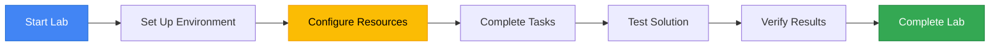

<div align="center">

# Manage Data Models in Looker: Challenge Lab
### Google Cloud Skills Boost - Lab GSP365

[]()

##  Lab Overview

This lab provides hands-on experience with Google Cloud services. You'll learn key concepts, configure resources, and gain practical skills for working with cloud infrastructure and applications.



---
##  Quick Start Guide

## Task 1. Create LookML objects
### Google Cloud Skills Boost - Lab GSP365
```bash
view: order_items {
  sql_table_name: `cloud-training-demos.looker_ecomm.order_items`
    ;;
  drill_fields: [order_item_id]

  dimension: order_item_id {
    primary_key: yes
    type: number
    sql: ${TABLE}.id ;;
  }

  dimension_group: created {
    type: time
    timeframes: [
      raw,
      time,
      date,
      week,
      month,
      quarter,
      year
    ]
    sql: ${TABLE}.created_at ;;
  }

  dimension_group: delivered {
    type: time
    timeframes: [
      raw,
      date,
      week,
      month,
      quarter,
      year
    ]
    convert_tz: no
    datatype: date
    sql: ${TABLE}.delivered_at ;;
  }

  dimension: inventory_item_id {
    type: number
    # hidden: yes
    sql: ${TABLE}.inventory_item_id ;;
  }

  dimension: order_id {
    type: number
    sql: ${TABLE}.order_id ;;
  }

  dimension_group: returned {
    type: time
    timeframes: [
      raw,
      time,
      date,
      week,
      month,
      quarter,
      year
    ]
    sql: ${TABLE}.returned_at ;;
  }

  dimension: sale_price {
    type: number
    sql: ${TABLE}.sale_price ;;
  }

  dimension_group: shipped {
    type: time
    timeframes: [
      raw,
      date,
      week,
      month,
      quarter,
      year
    ]
    convert_tz: no
    datatype: date
    sql: ${TABLE}.shipped_at ;;
  }

  dimension: status {
    type: string
    sql: ${TABLE}.status ;;
  }

  dimension: user_id {
    type: number
    # hidden: yes
    sql: ${TABLE}.user_id ;;
  }

  measure: average_sale_price {
    type: average
    sql: ${sale_price} ;;
    drill_fields: [detail*]
    value_format_name: usd_0
  }

  measure: order_item_count {
    type: count
    drill_fields: [detail*]
  }

  measure: order_count {
    type: count_distinct
    sql: ${order_id} ;;
  }

  measure: total_revenue {
    type: sum
    sql: ${sale_price} ;;
    value_format_name: usd
  }

  measure: total_revenue_from_completed_orders {
    type: sum
    sql: ${sale_price} ;;
    filters: [status: "Complete"]
    value_format_name: usd
  }

  dimension: profit {
    label: "profit"
    description: "sgggf"
    type: number
    sql: ${sale_price} - ${products.cost} ;;
    value_format_name: usd
  }

  measure: total_profit {
    label: "total_profit"
    description: "sgggf sum"
    type: sum
    sql: ${profit} ;;
    value_format_name: usd
  }

  # ----- Sets of fields for drilling ------
  set: detail {
    fields: [
      order_item_id,
      users.last_name,
      users.id,
      users.first_name,
      inventory_items.id,
      inventory_items.product_name
    ]
  }
}
```

### Google Cloud Skills Boost - Lab GSP365
```bash
connection: "bigquery_public_data_looker"

#
include: "/views/*.view"
include: "/z_tests/*.lkml"
include: "/**/*.dashboard"

#
datagroup: training_ecommerce_default_datagroup {
  sql_trigger: SELECT MAX(id) FROM etl_log;;
  max_cache_age: "1 hour"
}

#
persist_with: training_ecommerce_default_datagroup

#
label: "E-Commerce Training"

#
explore: order_items {
  join: users {
    type: left_outer
    sql_on: ${order_items.user_id} = ${users.id} ;;
    relationship: many_to_one
  }
  
  join: inventory_items {
    type: left_outer
    sql_on: ${order_items.inventory_item_id} = ${inventory_items.id} ;;
    relationship: many_to_one
  }
  
  join: products {
    type: left_outer
    sql_on: ${inventory_items.product_id} = ${products.id} ;;
    relationship: many_to_one
  }
  
  join: distribution_centers {
    type: left_outer
    sql_on: ${products.distribution_center_id} = ${distribution_centers.id} ;;
    relationship: many_to_one
  }
}

#
explore: events {
  join: event_session_facts {
    type: left_outer
    sql_on: ${events.session_id} = ${event_session_facts.session_id} ;;
    relationship: many_to_one
  }
  join: event_session_funnel {
    type: left_outer
    sql_on: ${events.session_id} = ${event_session_funnel.session_id} ;;
    relationship: many_to_one
  }
  join: users {
    type: left_outer
    sql_on: ${events.user_id} = ${users.id} ;;
    relationship: many_to_one
  } 
}

#
datagroup: NAME_DATAGROUP {
  sql_trigger: SELECT DATE_TRUNC(CURRENT_DATE(), WEEK);;
  max_cache_age: "168 hours"
}

#
persist_with: NAME_DATAGROUP

#
explore: +order_items {
  label: ""
  aggregate_table: weekly_aggregate_revenue_profit {
    query: {
      dimensions: [order_items.created_date]
      measures: [order_items.total_revenue, order_items.total_profit]
    }
    
    materialization: {
      datagroup_trigger: NAME_DATAGROUP
      increment_key: "created_date"
    }
  }
}
```
## Task 2. Create and fix a refinement with an aggregate table
### Google Cloud Skills Boost - Lab GSP365
```bash
explore: +order_items {

    query: EduLinkUp {
      dimensions: [created_month]
      measures: [total_profit, total_revenue]
    }
    }
```

## Task 3. Extend a view
## Create View
```bash
view: VIEW_NAME {
extension: required

dimension: id {
primary_key: yes
type: number
sql: ${TABLE}.id ;;
}

dimension: email {
type: string
sql: ${TABLE}.email ;;
}

dimension: first_name {
type: string
sql: ${TABLE}.first_name ;;
}

dimension: last_name {
type: string
sql: ${TABLE}.last_name ;;
}

dimension: latitude {
type: number
sql: ${TABLE}.latitude ;;
}

dimension: longitude {
type: number
sql: ${TABLE}.longitude ;;
}
}
```
## Task 4. Group similar fields in views
### Google Cloud Skills Boost - Lab GSP365
```bash
view: users {
  sql_table_name: `cloud-training-demos.looker_ecomm.users`
    ;;
  drill_fields: [id]

  dimension: id {
    primary_key: yes
    type: number
    hidden: yes
    sql: ${TABLE}.id ;;
  }

  dimension: age {
    type: number
    group_label:"GROUP_NAME"
    sql: ${TABLE}.age ;;
  }

  dimension: city {
    type: string
    group_label:"GROUP_NAME"
    sql: ${TABLE}.city ;;
  }

  dimension: country {
    type: string
    group_label:"GROUP_NAME"
    map_layer_name: countries
    sql: ${TABLE}.country ;;
  }

  dimension_group: created {
    type: time
    timeframes: [
      raw,
      time,
      date,
      week,
      month,
      quarter,
      year
    ]
    sql: ${TABLE}.created_at ;;
  }

  dimension: email {
    type: string
    hidden: yes
    sql: ${TABLE}.email ;;
  }

  dimension: first_name {
    type: string
    hidden: yes
    sql: ${TABLE}.first_name ;;
  }

  dimension: gender {
    type: string
    sql: ${TABLE}.gender ;;
  }

  dimension: last_name {
    type: string
    hidden: yes
    sql: ${TABLE}.last_name ;;
  }

  dimension: latitude {
    type: number
    hidden: yes
    sql: ${TABLE}.latitude ;;
  }

  dimension: longitude {
    type: number
    hidden: yes
    sql: ${TABLE}.longitude ;;
  }

  dimension: state {
    type: string
    group_label:"GROUP_NAME"
    sql: ${TABLE}.state ;;
    map_layer_name: us_states
  }

  dimension: traffic_source {
    type: string
    sql: ${TABLE}.traffic_source ;;
  }

  dimension: zip {
    type: zipcode
    sql: ${TABLE}.zip ;;
  }

  measure: count {
    type: count
    drill_fields: [id, last_name, first_name, events.count, order_items.count]
  }
}
```
### Google Cloud Skills Boost - Lab GSP365
```bash
view: products {
  sql_table_name: `cloud-training-demos.looker_ecomm.products`
    ;;
  drill_fields: [id]

  dimension: id {
    primary_key: yes
    type: number
    sql: ${TABLE}.id ;;
  }

  dimension: brand {
    type: string
    group_label:"GROUP_NAME"
    sql: ${TABLE}.brand ;;
  }

  dimension: category {
    type: string
    group_label:"GROUP_NAME"
    sql: ${TABLE}.category ;;
  }

  dimension: cost {
    type: number
    sql: ${TABLE}.cost ;;
  }

  dimension: department {
    type: string
    group_label:"GROUP_NAME"
    sql: ${TABLE}.department ;;
  }

  dimension: distribution_center_id {
    type: string
    # hidden: yes
    sql: ${TABLE}.distribution_center_id ;;
  }

  dimension: name {
    type: string
    group_label:"GROUP_NAME"
    sql: ${TABLE}.name ;;
  }

  dimension: retail_price {
    type: number
    sql: ${TABLE}.retail_price ;;
  }

  dimension: sku {
    type: string
    sql: ${TABLE}.sku ;;
  }

  measure: count {
    type: count
    drill_fields: [id, name, distribution_centers.name, distribution_centers.id, inventory_items.count]
  }
}
```

---

<div align="center">

## **Google Cloud Arcade Hub**

</div>

<p>
Discover the Google Cloud Arcade Hub - <b>Track progress with EduLinkUp's exclusive Arcade points calculator</b>, Skill Badges, Arcade Games and Arcade Trivia, explore lab-free courses, and join the Facilitator program for milestones, recognition, and swags.
</p>

<div align="center">

[](https://edulinkup.dev/arcade-calculator)

</div>

<ul>
<li><strong>Arcade Points Calculator</strong>: Estimate points, plan goals, and see leaderboard impact.</li>
<li><strong>Badges & Games</strong>: Earn badges for achievements and play bite-sized learning games.</li>
<li><strong>Lab-Free Courses</strong>: Access curated, free learning paths and practice labs to achieve milestones in the Facilitaor Program.</li>
<li><strong>Facilitator Program</strong>: Guides, milestone tracking, community roles, and swags.</li>
</ul>

## 🔐 Important Notice

```mermaid
graph LR
    Start([Use This Resource?]) --> Question{What's Your Goal?}
    Question -->|Learn & Understand| Manual[📚 Study the Code]
    Question -->|Quick Review| Auto[âš¡ Use Automation]
    Question -->|Certification Prep| Both[🎯 Do Both]
    
    Manual --> Read[Read Script Line by Line]
    Read --> Understand[Understand Each Command]
    Understand --> Practice[Practice Manually First]
    
    Auto --> Review[Review Before Running]
    Review --> Execute[Execute Script]
    Execute --> Reflect[Reflect on Output]
    
    Both --> Manual
    Both --> Auto
    
    Practice --> Success([✅ Deep Learning Achieved])
    Reflect --> Success
    
    style Start fill:#E3F2FD,stroke:#1976D2,color:#000
    style Success fill:#C8E6C9,stroke:#388E3C,color:#000
    style Manual fill:#FFF3E0,stroke:#F57C00,color:#000
    style Auto fill:#F3E5F5,stroke:#7B1FA2,color:#000
    style Both fill:#E0F2F1,stroke:#00796B,color:#000
```

<div align="center">



</div>

<details>
<summary><b> ⚠️ Disclaimer ⚠️- 📖 Educational Use Policy (Expand)</b></summary>

<br>

**Purpose**  
This repository provides learning resources to help you understand Google Cloud Platform services. The automation scripts are designed to demonstrate best practices and accelerate your learning journey.

<table>
<tr>
<td width="50%" valign="top">

### Google Cloud Skills Boost - Lab GSP365

- Study and understand the underlying Google Cloud operations
- Learn automation techniques for cloud infrastructure
- Prepare for certification or professional development
- Review concepts after manual completion

</td>
<td width="50%" valign="top">

### Google Cloud Skills Boost - Lab GSP365

- Comply with Google Cloud Skills Boost terms of service
- Use scripts for educational purposes only
- Complete manual labs first before using automation
- Give proper attribution if sharing or modifying

</td>
</tr>
</table>

**Ethical Considerations**  
We believe in learning through understanding. While our scripts save time, we strongly encourage you to:

<div align="center">

| Step | Action | Why It Matters |
|------|--------|----------------|
| 1️⃣ | Read through the script code | Understand what will happen |
| 2️⃣ | Complete labs manually first | Build foundational knowledge |
| 3️⃣ | Understand each command | Learn the "why" not just "how" |
| 4️⃣ | Use automation as a tool | Reinforce learning, don't replace it |

</div>

</details>

---

## 🛠️ Troubleshooting

```mermaid
graph LR
    Issue[❌ Encountered Issue?] --> Type{Issue Type}
    
    Type -->|Permission| P1[Check IAM Roles]
    Type -->|API| A1[Verify API Enabled]
    Type -->|Authentication| Auth1[Re-authenticate]
    Type -->|Script| S1[Check Script Syntax]
    
    P1 --> P2[Add Required Permissions]
    A1 --> A2[Enable in Console]
    Auth1 --> Auth2[gcloud auth login]
    S1 --> S2[Review Error Output]
    
    P2 --> Retry[🔄 Retry Operation]
    A2 --> Retry
    Auth2 --> Retry
    S2 --> Retry
    
    Retry --> Success{Fixed?}
    Success -->|Yes| Done([✅ Resolved])
    Success -->|No| Help[📞 Seek Help]
    
    style Issue fill:#FFCDD2,stroke:#C62828,color:#000
    style Done fill:#C8E6C9,stroke:#388E3C,color:#000
    style Retry fill:#FFF9C4,stroke:#F9A825,color:#000
    style Help fill:#E1BEE7,stroke:#8E24AA,color:#000
```

<div align="center">



</div>

<br>

Having issues? Here are quick solutions:

| Issue | Solution |
|-------|----------|
| Script won't run | Check execute permissions with `ls -la` |
| Authentication errors | Verify you're logged into the correct project |
| API not enabled | Enable required APIs in console |
| Timeout errors | Check your internet connection and retry |
| Permission denied | Ensure your account has proper IAM roles |

---

## **Join Our Growing Ecosystem**

[](https://edulinkup.dev) [](https://www.linkedin.com/company/edulinkup) [](https://www.youtube.com/@EduLinkUp)

---

### Google Cloud Skills Boost - Lab GSP365

<div align="center">
<a href="https://www.linkedin.com/in/eccentricexplorer" target="_blank" rel="noopener noreferrer">
    
</a> &nbsp;
<a href="https://www.linkedin.com/in/akshaykumar0611" target="_blank" rel="noopener noreferrer">
    
</a>

<br/>

<p>
  <a href="https://www.linkedin.com/in/eccentricexplorer">
    
  </a> &nbsp;
  <a href="https://www.linkedin.com/in/akshaykumar0611">
    
  </a>
</p>

</div>

---

### Google Cloud Skills Boost - Lab GSP365

**Stay updated with everything happening in the EduLinkUp universe:**

[](https://chat.whatsapp.com/HN5eOl0p5DBKBqTbIiOTgv)

</div>

---

<div align="center">

*This guide was crafted with care to enhance your Google Cloud learning experience.*  
*Remember: Understanding beats completion. Take your time and enjoy the journey.*

<sub>Last updated: January 2026 | Version 1.0</sub>

</div>


