<div align="center">

# Material Components for Flutter Basics
### Google Skills - Lab GSP887

[](https://www.skills.google/games/7003/labs/43516)

##  Lab Overview

This lab provides hands-on experience with Google Cloud services. You'll learn key concepts, configure resources, and gain practical skills for working with cloud infrastructure and applications.


---
##  Quick Start Guide

Note: If the `Clone Repository` button does not appear in the IDE sidebar, clone the repository manually using the `git clone` command

`Login.Dart`

```bash
// Copyright 2018-present the Flutter authors. All Rights Reserved.
//
// Licensed under the Apache License, Version 2.0 (the "License");
// you may not use this file except in compliance with the License.
// You may obtain a copy of the License at
//
// http://www.apache.org/licenses/LICENSE-2.0
//
// Unless required by applicable law or agreed to in writing, software
// distributed under the License is distributed on an "AS IS" BASIS,
// WITHOUT WARRANTIES OR CONDITIONS OF ANY KIND, either express or implied.
// See the License for the specific language governing permissions and
// limitations under the License.

import 'package:flutter/material.dart';

class LoginPage extends StatefulWidget {
  const LoginPage({Key? key}) : super(key: key);

  @override
  _LoginPageState createState() => _LoginPageState();
}

class _LoginPageState extends State<LoginPage> {
  // TODO: Add text editing controllers (101)
   // TODO: Add text editing controllers (101)
  final _usernameController = TextEditingController();
  final _passwordController = TextEditingController(); 
  @override
  Widget build(BuildContext context) {
    return Scaffold(
      body: SafeArea(
        child: ListView(
          padding: const EdgeInsets.symmetric(horizontal: 24.0),
          children: <Widget>[
            const SizedBox(height: 80.0),
            Column(
              children: <Widget>[
                Image.asset('assets/diamond.png'),
                const SizedBox(height: 16.0),
                const Text('SHRINE'),
              ],
            ),
            const SizedBox(height: 120.0),
            // TODO: Remove filled: true values (103)
            // TODO: Add TextField widgets (101)
            // [Name]
            TextField(
              controller: _usernameController,
              decoration: InputDecoration(
                filled: true,
                labelText: 'Username',
              ),
            ),
            // spacer
            const SizedBox(height: 12.0),
            // [Password]
            TextField(
               controller: _passwordController,
              decoration: InputDecoration(
                filled: true,
                labelText: 'Password',
              ),
              obscureText: true,
            ),

            // TODO: Add button bar (101)
  // TODO: Add button bar (101)
  OverflowBar(
    alignment: MainAxisAlignment.end,
    // TODO: Add a beveled rectangular border to CANCEL (103)
    children: <Widget>[
      // TODO: Add buttons (101)
    ],
  ),

   // TODO: Add buttons (101)
    TextButton(
      child: const Text('CANCEL'),
      onPressed: () {
        // TODO: Clear the text fields (101)
        _usernameController.clear();
        _passwordController.clear();
      },
    ),
    // TODO: Add an elevation to NEXT (103)
    // TODO: Add a beveled rectangular border to NEXT (103)
    ElevatedButton(
      child: const Text('NEXT'),
      onPressed: () {
    // TODO: Show the next page (101) 
    Navigator.pop(context);
      },
    ),


          ],
        ),
      ),
    );
  }
}
```
`Home.Dart`
```bash
// Copyright 2018-present the Flutter authors. All Rights Reserved.
//
// Licensed under the Apache License, Version 2.0 (the "License");
// you may not use this file except in compliance with the License.
// You may obtain a copy of the License at
//
// http://www.apache.org/licenses/LICENSE-2.0
//
// Unless required by applicable law or agreed to in writing, software
// distributed under the License is distributed on an "AS IS" BASIS,
// WITHOUT WARRANTIES OR CONDITIONS OF ANY KIND, either express or implied.
// See the License for the specific language governing permissions and
// limitations under the License.

import 'package:flutter/material.dart';
import 'package:intl/intl.dart';
import 'model/products_repository.dart';
import 'model/product.dart';

class HomePage extends StatelessWidget {
  const HomePage({Key? key}) : super(key: key);

  // TODO: Make a collection of cards (102)
  // TODO: Make a collection of cards (102)

// Replace this entire method
List<Card> _buildGridCards(BuildContext context) {
  List<Product> products = ProductsRepository.loadProducts(Category.all);

  if (products == null || products.isEmpty) {
    return const <Card>[];
  }

  final ThemeData theme = Theme.of(context);
  final NumberFormat formatter = NumberFormat.simpleCurrency(
      locale: Localizations.localeOf(context).toString());

  return products.map((product) {
    return Card(
      clipBehavior: Clip.antiAlias,
      // TODO: Adjust card heights (103)
      child: Column(
        // TODO: Center items on the card (103)
        crossAxisAlignment: CrossAxisAlignment.start,
        children: <Widget>[
          AspectRatio(
            aspectRatio: 18 / 11,
            child: Image.asset(
              product.assetName,
              package: product.assetPackage,
             // TODO: Adjust the box size (102)
             fit: BoxFit.fitWidth,
            ),
          ),
          Expanded(
            child: Padding(
              padding: EdgeInsets.fromLTRB(16.0, 12.0, 16.0, 8.0),
              child: Column(
               // TODO: Align labels to the bottom and center (103)
               crossAxisAlignment: CrossAxisAlignment.start,
                // TODO: Change innermost Column (103)
                children: <Widget>[
                 // TODO: Handle overflowing labels (103)
                 Text(
                    product.name,
                    style: theme.textTheme.headline6,
                    maxLines: 1,
                  ),
                  SizedBox(height: 8.0),
                  Text(
                    formatter.format(product.price),
                    style: theme.textTheme.subtitle2,
                  ),
                ],
              ),
            ),
          ),
        ],
      ),
    );
  }).toList();
}
  // TODO: Make a collection of cards (102)
  List<Card> _buildGridCards(int count) {
    List<Card> cards = List.generate(
      count,
      (int index) => Card(
        clipBehavior: Clip.antiAlias,
        child: Column(
          crossAxisAlignment: CrossAxisAlignment.start,
  children: <Widget>[
    Card(
      clipBehavior: Clip.antiAlias,
      child: Column(
        crossAxisAlignment: CrossAxisAlignment.start,
        children: <Widget>[
          AspectRatio(
            aspectRatio: 18.0 / 11.0,
            child: Image.asset('assets/diamond.png'),
          ),
          Padding(
            padding: const EdgeInsets.fromLTRB(16.0, 12.0, 16.0, 8.0),
            child: Column(
              crossAxisAlignment: CrossAxisAlignment.start,
              children: <Widget>[
                Text('Title'),
                const SizedBox(height: 8.0),
                Text('Secondary Text'),
              ],
            ),
          ),
        ],
      ),
    )
  ],
        ),
      ),
    );

    return cards;
  }

  // TODO: Add a variable for Category (104)
  @override
  Widget build(BuildContext context) {
    // TODO: Return an AsymmetricView (104)
    return Scaffold(
      // TODO: Add app bar (102)
      // TODO: Add app bar (102)
      appBar: AppBar(
        // TODO: Add buttons and title (102)
        // TODO: Add buttons and title (102)
        leading: IconButton(
          icon: Icon(
            Icons.menu,
            semanticLabel: 'menu',
          ),
          onPressed: () {
            print('Menu button');
          },
        ),
        title: Text('SHRINE'),
        // TODO: Add trailing buttons (102)
        // TODO: Add trailing buttons (102)
        actions: <Widget>[
          IconButton(
            icon: Icon(
              Icons.search,
              semanticLabel: 'search',
            ),
            onPressed: () {
              print('Search button');
            },
          ),
          IconButton(
            icon: Icon(
              Icons.tune,
              semanticLabel: 'filter',
            ),
            onPressed: () {
              print('Filter button');
            },
          ),
        ],
      ),
      // TODO: Add a grid view (102)
      // TODO: Add a grid view (102)
body: GridView.count(
  crossAxisCount: 2,
  padding: EdgeInsets.all(16.0),
  childAspectRatio: 8.0 / 9.0,
  children: _buildGridCards(context) // Changed code
),
// TODO: Add a grid view (102)
      body: GridView.count(
          crossAxisCount: 2,
          padding: EdgeInsets.all(16.0),
          childAspectRatio: 8.0 / 9.0,
          children: _buildGridCards(10) // Replace
          ),
      // TODO: Set resizeToAvoidBottomInset (101)
      resizeToAvoidBottomInset: false,
    );
    // TODO: Pass Category variable to AsymmetricView (104)
    return const Scaffold(
      // TODO: Add app bar (102)
      // TODO: Add a grid view (102)
      body: Center(
        child: Text('You did it!'),
      ),
      // TODO: Set resizeToAvoidBottomInset (101)
    );
  }
}
```


---

<div align="center">

## **Google Cloud Arcade Hub**

</div>

<p>
Discover the Google Cloud Arcade Hub - <b>Track progress with EduLinkUp's exclusive Arcade points calculator</b>, Skill Badges, Arcade Games and Arcade Trivia, explore lab-free courses, and join the Facilitator program for milestones, recognition, and swags.
</p>

<div align="center">

[](https://edulinkup.dev/arcade-calculator)

</div>

<ul>
<li><strong>Arcade Points Calculator</strong>: Estimate points, plan goals, and see leaderboard impact.</li>
<li><strong>Badges & Games</strong>: Earn badges for achievements and play bite-sized learning games.</li>
<li><strong>Lab-Free Courses</strong>: Access curated, free learning paths and practice labs to achieve milestones in the Facilitaor Program.</li>
<li><strong>Facilitator Program</strong>: Guides, milestone tracking, community roles, and swags.</li>
</ul>

## 🔐 Important Notice

```mermaid
graph LR
    Start([Use This Resource?]) --> Question{What's Your Goal?}
    Question -->|Learn & Understand| Manual[📚 Study the Code]
    Question -->|Quick Review| Auto[⚡ Use Automation]
    Question -->|Certification Prep| Both[🎯 Do Both]
    
    Manual --> Read[Read Script Line by Line]
    Read --> Understand[Understand Each Command]
    Understand --> Practice[Practice Manually First]
    
    Auto --> Review[Review Before Running]
    Review --> Execute[Execute Script]
    Execute --> Reflect[Reflect on Output]
    
    Both --> Manual
    Both --> Auto
    
    Practice --> Success([✅ Deep Learning Achieved])
    Reflect --> Success
    
    style Start fill:#E3F2FD,stroke:#1976D2,color:#000
    style Success fill:#C8E6C9,stroke:#388E3C,color:#000
    style Manual fill:#FFF3E0,stroke:#F57C00,color:#000
    style Auto fill:#F3E5F5,stroke:#7B1FA2,color:#000
    style Both fill:#E0F2F1,stroke:#00796B,color:#000
```

<div align="center">



</div>

<details>
<summary><b> ⚠️ Disclaimer ⚠️- 📖 Educational Use Policy (Expand)</b></summary>

<br>

**Purpose**  
This repository provides learning resources to help you understand Google Cloud Platform services. The automation scripts are designed to demonstrate best practices and accelerate your learning journey.

<table>
<tr>
<td width="50%" valign="top">

### ✅ Intended Use

- Study and understand the underlying Google Cloud operations
- Learn automation techniques for cloud infrastructure
- Prepare for certification or professional development
- Review concepts after manual completion

</td>
<td width="50%" valign="top">

### 📜 Terms of Service

- Comply with Google Cloud Skills Boost terms of service
- Use scripts for educational purposes only
- Complete manual labs first before using automation
- Give proper attribution if sharing or modifying

</td>
</tr>
</table>

**Ethical Considerations**  
We believe in learning through understanding. While our scripts save time, we strongly encourage you to:

<div align="center">

| Step | Action | Why It Matters |
|------|--------|----------------|
| 1️⃣ | Read through the script code | Understand what will happen |
| 2️⃣ | Complete labs manually first | Build foundational knowledge |
| 3️⃣ | Understand each command | Learn the "why" not just "how" |
| 4️⃣ | Use automation as a tool | Reinforce learning, don't replace it |

</div>

</details>

---

## 🛠️ Troubleshooting

```mermaid
graph LR
    Issue[❌ Encountered Issue?] --> Type{Issue Type}
    
    Type -->|Permission| P1[Check IAM Roles]
    Type -->|API| A1[Verify API Enabled]
    Type -->|Authentication| Auth1[Re-authenticate]
    Type -->|Script| S1[Check Script Syntax]
    
    P1 --> P2[Add Required Permissions]
    A1 --> A2[Enable in Console]
    Auth1 --> Auth2[gcloud auth login]
    S1 --> S2[Review Error Output]
    
    P2 --> Retry[🔄 Retry Operation]
    A2 --> Retry
    Auth2 --> Retry
    S2 --> Retry
    
    Retry --> Success{Fixed?}
    Success -->|Yes| Done([✅ Resolved])
    Success -->|No| Help[📞 Seek Help]
    
    style Issue fill:#FFCDD2,stroke:#C62828,color:#000
    style Done fill:#C8E6C9,stroke:#388E3C,color:#000
    style Retry fill:#FFF9C4,stroke:#F9A825,color:#000
    style Help fill:#E1BEE7,stroke:#8E24AA,color:#000
```

<div align="center">



</div>

<br>

Having issues? Here are quick solutions:

| Issue | Solution |
|-------|----------|
| Script won't run | Check execute permissions with `ls -la` |
| Authentication errors | Verify you're logged into the correct project |
| API not enabled | Enable required APIs in console |
| Timeout errors | Check your internet connection and retry |
| Permission denied | Ensure your account has proper IAM roles |

---

## **Join Our Growing Ecosystem**

[](https://edulinkup.dev) [](https://www.linkedin.com/company/edulinkup) [](https://www.youtube.com/@EduLinkUp)

---

### 📩 **Let's Connect Personally**

<div align="center">
<a href="https://www.linkedin.com/in/eccentricexplorer" target="_blank" rel="noopener noreferrer">
    
</a> &nbsp;
<a href="https://www.linkedin.com/in/akshaykumar0611" target="_blank" rel="noopener noreferrer">
    
</a>

<br/>

<p>
  <a href="https://www.linkedin.com/in/eccentricexplorer">
    
  </a> &nbsp;
  <a href="https://www.linkedin.com/in/akshaykumar0611">
    
  </a>
</p>

</div>

---

### 🌱 **Join the Developer Community**

**Stay updated with everything happening in the EduLinkUp universe:**

[](https://chat.whatsapp.com/HN5eOl0p5DBKBqTbIiOTgv)

</div>

---

<div align="center">

*This guide was crafted with care to enhance your Google Cloud learning experience.*  
*Remember: Understanding beats completion. Take your time and enjoy the journey.*

<sub>Last updated: January 2026 | Version 1.0</sub>

</div>


