<!-- Hero: Google Cloud styled badges -->

# Google Cloud Arcade Lab Solutions by EduLinkUp

  &nbsp;

Welcome to the Arcade Google Cloud Labs - a curated, hands-on collection of challenge labs, quick-starts, and worked solutions for learning Google Cloud services through real exercises.

---

## Visual Roadmap

---

## How to use this repo

1. Open a lab folder under the repo root.
2. Read the `EduLinkUp.md` for context, Quick Start commands, and troubleshooting.
3. Inspect any script files before execution. Example (Cloud Shell):

---

## Safety & best practices

- Review any script before running. These are educational scripts and may modify cloud resources.
- Use a dedicated test project and monitor quotas and billing.
- Revoke unnecessary service account permissions after experiments.

---
## 🔐 Important Notice

```mermaid
graph LR
    Start([Use This Resource?]) --> Question{What's Your Goal?}
    Question -->|Learn & Understand| Manual[📚 Study the Code]
    Question -->|Quick Review| Auto[⚡ Use Automation]
    Question -->|Certification Prep| Both[🎯 Do Both]
    
    Manual --> Read[Read Script Line by Line]
    Read --> Understand[Understand Each Command]
    Understand --> Practice[Practice Manually First]
    
    Auto --> Review[Review Before Running]
    Review --> Execute[Execute Script]
    Execute --> Reflect[Reflect on Output]
    
    Both --> Manual
    Both --> Auto
    
    Practice --> Success([✅ Deep Learning Achieved])
    Reflect --> Success
    
    style Start fill:#E3F2FD,stroke:#1976D2,color:#000
    style Success fill:#C8E6C9,stroke:#388E3C,color:#000
    style Manual fill:#FFF3E0,stroke:#F57C00,color:#000
    style Auto fill:#F3E5F5,stroke:#7B1FA2,color:#000
    style Both fill:#E0F2F1,stroke:#00796B,color:#000
```

<b> ⚠️ Disclaimer ⚠️- 📖 Educational Use Policy (Expand)</b>

 

**Purpose**  
This repository provides learning resources to help you understand Google Cloud Platform services. The automation scripts are designed to demonstrate best practices and accelerate your learning journey.

<table>
<tr>
<td width="50%" valign="top">

### ✅ Intended Use

- Study and understand the underlying Google Cloud operations
- Learn automation techniques for cloud infrastructure
- Prepare for certification or professional development
- Review concepts after manual completion

</td>
<td width="50%" valign="top">

### 📜 Terms of Service

- Comply with Google Cloud Skills Boost terms of service
- Use scripts for educational purposes only
- Complete manual labs first before using automation
- Give proper attribution if sharing or modifying

</td>
</tr>
</table>

**Ethical Considerations**  
We believe in learning through understanding. While our scripts save time, we strongly encourage you to:

| Step | Action | Why It Matters |
|------|--------|----------------|
| 1️⃣ | Read through the script code | Understand what will happen |
| 2️⃣ | Complete labs manually first | Build foundational knowledge |
| 3️⃣ | Understand each command | Learn the "why" not just "how" |
| 4️⃣ | Use automation as a tool | Reinforce learning, don't replace it |

---

## 🛠️ Troubleshooting

```mermaid
graph LR
    Issue[❌ Encountered Issue?] --> Type{Issue Type}
    
    Type -->|Permission| P1[Check IAM Roles]
    Type -->|API| A1[Verify API Enabled]
    Type -->|Authentication| Auth1[Re-authenticate]
    Type -->|Script| S1[Check Script Syntax]
    
    P1 --> P2[Add Required Permissions]
    A1 --> A2[Enable in Console]
    Auth1 --> Auth2[gcloud auth login]
    S1 --> S2[Review Error Output]
    
    P2 --> Retry[🔄 Retry Operation]
    A2 --> Retry
    Auth2 --> Retry
    S2 --> Retry
    
    Retry --> Success{Fixed?}
    Success -->|Yes| Done([✅ Resolved])
    Success -->|No| Help[📞 Seek Help]
    
    style Issue fill:#FFCDD2,stroke:#C62828,color:#000
    style Done fill:#C8E6C9,stroke:#388E3C,color:#000
    style Retry fill:#FFF9C4,stroke:#F9A825,color:#000
    style Help fill:#E1BEE7,stroke:#8E24AA,color:#000
```

 

Having issues? Here are quick solutions:

| Issue | Solution |
|-------|----------|
| Script won't run | Check execute permissions with `ls -la` |
| Authentication errors | Verify you're logged into the correct project |
| API not enabled | Enable required APIs in console |
| Timeout errors | Check your internet connection and retry |
| Permission denied | Ensure your account has proper IAM roles |

---

## **Join Our Growing Ecosystem**

  

---

### 🌱 **Join the Developer Community**

**Stay updated with everything happening in the EduLinkUp universe:**

---

### 📩 **Let's Connect Personally**

 

 

---

*This guide was crafted with care to enhance your Google Cloud learning experience.*  
*Remember: Understanding beats completion. Take your time and enjoy the journey.*

Last updated: January 2026 | Version 1.0

---

## Issue Creation ✴
Report bugs and  issues or propose improvements through our GitHub repository.

## Contribution Guidelines 📑

  

- Firstly Star(⭐) the Repository
- Fork the Repository and create a new branch for any updates/changes/issue you are working on.
- Start Coding and do changes.
- Commit your changes
- Create a Pull Request which will be reviewed and suggestions would be added to improve it.
- Add Screenshots and updated website links to help us understand what changes is all about.

- Check the [CONTRIBUTING.md](CONTRIBUTING.md) for detailed steps...
    
## Contributing is fun🧡

We welcome all contributions and suggestions!
Whether it's a new feature, design improvement, or a bug fix — your voice matters 💜

Your insights are invaluable to us. Reach out to us team for any inquiries, feedback, or concerns.

## 📄 License

This project is open-source and available under the [MIT License](LICENSE).

Feel free to reach out with any questions or feedback\! Thanks for reading, here's a cookiepookie:

