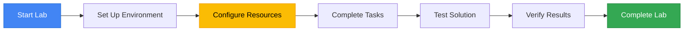

<div align="center">

# Writing LookML as a SQL Expert
### Google Cloud Skills Boost - Lab GSP1332

[](https://www.skills.google/catalog_lab/32492)

</div>

---

## 📋 Lab Overview

This lab introduces machine learning and AI capabilities on Google Cloud. You'll explore pre-trained models, build custom solutions, and leverage AI services to add intelligence to your applications.



---

## Create View `order_items`

```bash
view: order_items {
  sql_table_name: `cloud-training-demos.thelook_ecommerce.order_items` ;;
  drill_fields: [id]

  # ---------------------------
  # PRIMARY KEY
  # ---------------------------
  dimension: id {
    primary_key: yes
    type: number
    sql: ${TABLE}.id ;;
  }

  # ---------------------------
  # DATE DIMENSION GROUPS
  # ---------------------------
  dimension_group: created {
    type: time
    timeframes: [raw, time, date, week, month, quarter, year]
    sql: ${TABLE}.created_at ;;
  }

  dimension_group: delivered {
    type: time
    timeframes: [raw, time, date, week, month, quarter, year]
    sql: ${TABLE}.delivered_at ;;
  }

  dimension_group: returned {
    type: time
    timeframes: [raw, time, date, week, month, quarter, year]
    sql: ${TABLE}.returned_at ;;
  }

  dimension_group: shipped {
    type: time
    timeframes: [raw, time, date, week, month, quarter, year]
    sql: ${TABLE}.shipped_at ;;
  }

  # ---------------------------
  # OTHER DIMENSIONS
  # ---------------------------
  dimension: inventory_item_id {
    type: number
    sql: ${TABLE}.inventory_item_id ;;
  }

  dimension: order_id {
    type: number
    sql: ${TABLE}.order_id ;;
  }

  dimension: product_id {
    type: number
    sql: ${TABLE}.product_id ;;
  }

  dimension: user_id {
    type: number
    sql: ${TABLE}.user_id ;;
  }

  dimension: sale_price {
    type: number
    sql: ${TABLE}.sale_price ;;
  }

  dimension: status {
    type: string
    sql: ${TABLE}.status ;;
  }

  # ---------------------------
  # MEASURES
  # ---------------------------
  measure: count {
    label: "# of Order Items"
    type: count
    drill_fields: [id]
  }

  measure: total_sale_price {
    type: sum
    sql: ${sale_price} ;;
    value_format_name: usd
  }

  measure: customer_dividends {
    description: "Customers receive 10% of their total sales as a gift card for future purchases."
    type: number
    sql: 0.1 * ${total_sale_price} ;;
    value_format_name: usd
  }
}
```

## Open:  `qwiklabs-looker.model`
```bash
explore: order_items {
  label: "Ordered Items"

  join: users {
    type: left_outer
    sql_on: ${order_items.user_id} = ${users.id} ;;
    relationship: many_to_one
  }
}
```

## Update `order_items.view`

```bash
view: order_items {
  sql_table_name: `cloud-training-demos.thelook_ecommerce.order_items` ;;
  drill_fields: [id]

  # =========================
  # PRIMARY KEY
  # =========================
  dimension: id {
    primary_key: yes
    type: number
    sql: ${TABLE}.id ;;
  }

  # =========================
  # DATE DIMENSION GROUPS
  # =========================
  dimension_group: created {
    type: time
    timeframes: [raw, time, date, week, month, quarter, year]
    sql: ${TABLE}.created_at ;;
  }

  dimension_group: delivered {
    type: time
    timeframes: [raw, time, date, week, month, quarter, year]
    sql: ${TABLE}.delivered_at ;;
  }

  dimension_group: returned {
    type: time
    timeframes: [raw, time, date, week, month, quarter, year]
    sql: ${TABLE}.returned_at ;;
  }

  dimension_group: shipped {
    type: time
    timeframes: [raw, time, date, week, month, quarter, year]
    sql: ${TABLE}.shipped_at ;;
  }

  # =========================
  # OTHER DIMENSIONS
  # =========================
  dimension: inventory_item_id {
    type: number
    sql: ${TABLE}.inventory_item_id ;;
  }

  dimension: order_id {
    type: number
    sql: ${TABLE}.order_id ;;
  }

  dimension: product_id {
    type: number
    sql: ${TABLE}.product_id ;;
  }

  dimension: user_id {
    type: number
    sql: ${TABLE}.user_id ;;
  }

  dimension: sale_price {
    type: number
    sql: ${TABLE}.sale_price ;;
  }

  dimension: status {
    type: string
    sql: ${TABLE}.status ;;
  }

  # =========================
  # MEASURES
  # =========================
  measure: count {
    label: "# of Order Items"
    type: count
    drill_fields: [id]
  }

  measure: total_sale_price {
    type: sum
    sql: ${sale_price} ;;
    value_format_name: usd
  }

  measure: customer_dividends {
    description: "Customers receive 10% of their total sales as a gift card for future purchases."
    type: number
    sql: 0.1 * ${total_sale_price} ;;
    value_format_name: usd
  }
}
```

## Create View `top_100_users`

```bash
view: top_100_users {
  derived_table: {
    explore_source: order_items {
      column: user_id {}
      column: customer_dividends {}
      column: total_sale_price {}
      column: email { field: users.email }
    }
  }

  dimension: user_id {
    primary_key: yes
    type: number
  }

  dimension: customer_dividends {
    value_format: "$#,##0.00"
    type: number
  }

  dimension: total_sale_price {
    value_format: "$#,##0.00"
    type: number
  }

  dimension: email {
    type: string
  }
}
```

---

## **Join Our Growing Ecosystem**

<div align="center">

[](https://edulinkup.dev) [](https://www.linkedin.com/company/edulinkup) [](https://www.youtube.com/@EduLinkUp)

---

### 🌱 **Join the Developer Community**

**Stay updated with everything happening in the EduLinkUp universe:**

[](https://chat.whatsapp.com/FriEJ8otpKVJux3H08SUhJ)

---

### 📩 **Let's Connect Personally**

[](https://www.linkedin.com/in/eccentricexplorer)

</div>

---

<div align="center">

*This guide was crafted with care to enhance your Google Cloud learning experience.*  
*Remember: Understanding beats completion. Take your time and enjoy the journey.*

<sub>Last updated: January 2026 | Version 1.0</sub>

</div>
